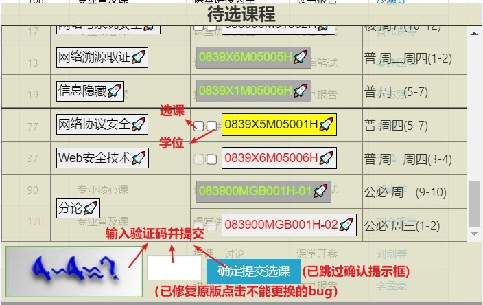
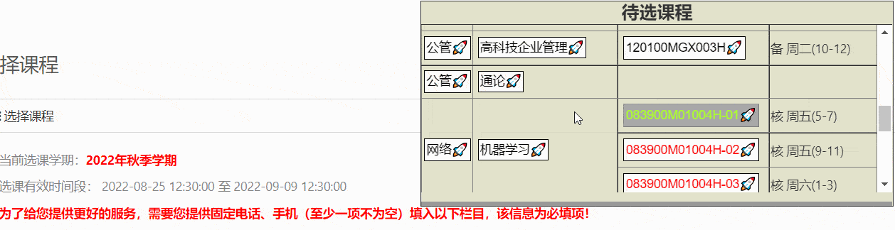

# UCAS Class Enrollment Assistant

 

## 界面
|筛选学院页面|选择课程页面|
|--|--|
|||

## 使用演示：

## 安装方法

1. 浏览器安装[Tampermonkey](https://www.tampermonkey.net/)插件，需要这个插件才能安装各种js脚本。（chrome商店需要科学上网，没有的可以试试[从这里下载](https://www.crxsoso.com/webstore/detail/dhdgffkkebhmkfjojejmpbldmpobfkfo)。
2. 进入[Greasy Fork脚本发布页面](https://greasyfork.org/zh-CN/scripts/450128-ucas-class-enrollment-assistant)。
3. 点击安装。

## 简介

这是一个方便抢课界面操作的脚本。包括的功能有：

1. **自动跳转：** 进入选课系统后，会自动跳转到选择课程页面。（如需查看通知公告 需要临时把脚本禁用）
2. **一键筛选学院：** 点击`学院名🚀`按钮可自动筛选学院。
3. **一键跳转到课程/课程号：** 点击`课程名/课程id🚀`可自动筛选学院，然后滚动到对应课程所在位置，并且课程名/课程号高亮。
4. **快速提交：** 选课页面内，插件ui添加验证码框+提交选课按钮（PS：修复了原网页中"点击切换验证码"没反应的bug，现在可以点击验证码图片更新没有加载出来的验证码了）。
5. **标注已抢到的课与已满员的课：** 分别用绿色和红色表示，方便抢课时迅速做出判断。已满员的课只有进入选课页面才会更新状态。

⚠️目前为自用版，而且由于需要赶在抢课之前完成，时间比较紧张，故配置待选课程需要**手动修改代码里的config**。

### 提示
抢课时不需要开多个窗口，因为服务器校验验证码只会跟最新的那一个比较。

## Changelog

v1.6:
- 在ui中标注已经抢到的课：文字变绿，按钮不可点击。并记录状态。
- 在ui的每一门课旁边添加选课/学位复选框
- 当前学院下已满员的课文字变红色。并记录状态。
- 重写HTML部分代码

v1.5:
- 在ui中添加验证码框
- 修复原网页中"点击切换验证码"没反应的bug
- 完善"定位到的课程高亮显示"，在选课页面内单击按钮也可以高亮对应匹配项。同时旧高亮内容取消高亮。
- 优化代码结构和注释

v1.4:
- 点击🚀按钮后保持高亮
- 定位到的课程高亮显示

## TODO List

**未来考虑添加的优化用户体验的功能：**

- [ ] 使用图形化界面录入待选课程
- [ ] 提交选课时自动跳过"确认提交吗"对话框

## 代码部分细节说明

- **筛选学院页面** 与 **选课页面** 的数据传输：

  因为锚点链接`#...`对http请求不会造成影响，因此突发奇想考虑用它传输json（用storage的话如果多开会互相覆盖数据），只需要修改form的action属性，试了之后发现可行。可以作为以后写脚本的一个思路。